# Solace CLI

A command-line tool for publishing and consuming messages from Solace queues using the JCSMP API, with Oracle database integration and batch file publishing capabilities.

## Architecture Overview


## Message Flow Diagrams

### Publish Command Flow


### Oracle Publish Flow


### Oracle Export Flow


### Folder Publish Flow

```mermaid
sequenceDiagram
    participant User
    participant CLI as Solace CLI
    participant FS as File System
    participant Solace as Solace Broker

    User->>CLI: folder-publish --folder /path
    CLI->>CLI: Parse arguments
    CLI->>FS: Scan directory
    FS-->>CLI: List of files
    CLI->>CLI: Filter by pattern
    CLI->>CLI: Sort files (if specified)
    CLI->>Solace: Connect to VPN
    Solace-->>CLI: Connection established

    loop For each file
        CLI->>FS: Read file content
        FS-->>CLI: File bytes
        CLI->>Solace: Publish message
        Solace-->>CLI: Acknowledge
    end

    CLI->>Solace: Disconnect
    CLI-->>User: Published N messages
```



### Two-Step Workflow: Export then Publish


### Oracle Insert Flow


### Consume Command Flow


## Component Architecture


## Deployment Architecture


---

## Features

- **Publish** messages to Solace queues with configurable delivery modes
- **Consume** messages with auto/manual acknowledgment
- **Browse** queue messages non-destructively
- **Oracle Integration** - Query Oracle database and publish result rows as messages
- **Oracle Export** - Export Oracle query results to files for later publishing
- **Folder Publishing** - Batch publish messages from files in a directory
- **Two-Step Workflow** - Export from Oracle to files, then publish to Solace
- Support for reading message content from stdin, file, or command line
- Verbose output with message metadata
- Write received messages to files

## Prerequisites

- Java 1.8 or higher
- Maven 3.6+ or Gradle 8.x
- Access to a Solace message broker
- Oracle database (for oracle-publish command)

## Building

### Using Maven

```bash
# Build executable JAR with all dependencies
mvn clean package

# The JAR will be at target/solace-cli-1.0.0.jar
```

### Using Gradle

```bash
# Build executable JAR with all dependencies
./gradlew assemble

# The JAR will be at build/libs/solace-cli-1.0.0-all.jar
```

## Commands Overview

| Command | Aliases | Description |
|---------|---------|-------------|
| `publish` | `pub`, `send` | Publish a single message to a Solace queue |
| `consume` | `sub`, `receive` | Consume messages from a Solace queue |
| `oracle-publish` | `ora-pub` | Query Oracle database and publish results as messages |
| `oracle-export` | `ora-export`, `ora-exp` | Export Oracle query results to files in a folder |
| `oracle-insert` | `ora-insert`, `ora-ins` | Insert file contents from a folder into Oracle database |
| `folder-publish` | `folder-pub`, `dir-pub` | Publish messages from files in a folder |

## Usage

### General Help

```bash
java -jar target/solace-cli-1.0.0.jar --help
```

### Connection Options (required for all commands)

| Option | Description |
|--------|-------------|
| `-H, --host` | Solace broker host (e.g., `tcp://localhost:55555`) |
| `-v, --vpn` | Message VPN name |
| `-u, --username` | Username for authentication |
| `-p, --password` | Password (interactive prompt if omitted) |
| `-q, --queue` | Queue name |

---

## Publishing Messages

```bash
# Publish a simple message
java -jar target/solace-cli-1.0.0.jar publish \
  -H tcp://localhost:55555 \
  -v default \
  -u admin \
  -p admin \
  -q my-queue \
  "Hello, Solace!"

# Publish from a file
java -jar target/solace-cli-1.0.0.jar publish \
  -H tcp://localhost:55555 \
  -v default \
  -u admin \
  -p admin \
  -q my-queue \
  -f message.xml

# Publish from stdin (useful for piping)
echo "Message from pipe" | java -jar target/solace-cli-1.0.0.jar publish \
  -H tcp://localhost:55555 \
  -v default \
  -u admin \
  -p admin \
  -q my-queue

# Publish multiple messages
java -jar target/solace-cli-1.0.0.jar publish \
  -H tcp://localhost:55555 \
  -v default \
  -u admin \
  -p admin \
  -q my-queue \
  -c 100 \
  "Test message"

# Publish with correlation ID and TTL
java -jar target/solace-cli-1.0.0.jar publish \
  -H tcp://localhost:55555 \
  -v default \
  -u admin \
  -p admin \
  -q my-queue \
  --correlation-id "order-12345" \
  --ttl 60000 \
  "Order data"
```

### Publish Options

| Option | Description |
|--------|-------------|
| `-f, --file` | Read message from file |
| `-c, --count` | Number of messages to send (default: 1) |
| `--correlation-id` | Set correlation ID |
| `--delivery-mode` | PERSISTENT (default) or DIRECT |
| `--ttl` | Time to live in milliseconds |

---

## Consuming Messages

```bash
# Consume messages (Ctrl+C to stop)
java -jar target/solace-cli-1.0.0.jar consume \
  -H tcp://localhost:55555 \
  -v default \
  -u admin \
  -p admin \
  -q my-queue

# Consume specific number of messages
java -jar target/solace-cli-1.0.0.jar consume \
  -H tcp://localhost:55555 \
  -v default \
  -u admin \
  -p admin \
  -q my-queue \
  -n 10

# Consume with timeout
java -jar target/solace-cli-1.0.0.jar consume \
  -H tcp://localhost:55555 \
  -v default \
  -u admin \
  -p admin \
  -q my-queue \
  -t 30

# Browse messages (non-destructive)
java -jar target/solace-cli-1.0.0.jar consume \
  -H tcp://localhost:55555 \
  -v default \
  -u admin \
  -p admin \
  -q my-queue \
  --browse

# Verbose output with metadata
java -jar target/solace-cli-1.0.0.jar consume \
  -H tcp://localhost:55555 \
  -v default \
  -u admin \
  -p admin \
  -q my-queue \
  --verbose

# Save messages to files
java -jar target/solace-cli-1.0.0.jar consume \
  -H tcp://localhost:55555 \
  -v default \
  -u admin \
  -p admin \
  -q my-queue \
  -o ./received-messages

# Save with custom file extension and prefix
java -jar target/solace-cli-1.0.0.jar consume \
  -H tcp://localhost:55555 \
  -v default \
  -u admin \
  -p admin \
  -q my-queue \
  -o ./received-messages \
  --extension .xml \
  --prefix order_

# Use correlation ID as filename
java -jar target/solace-cli-1.0.0.jar consume \
  -H tcp://localhost:55555 \
  -v default \
  -u admin \
  -p admin \
  -q my-queue \
  -o ./received-messages \
  --use-correlation-id \
  --extension .json
```

### Consume Options

| Option | Description |
|--------|-------------|
| `-n, --count` | Number of messages to consume (0 = unlimited) |
| `-t, --timeout` | Timeout in seconds (0 = wait forever) |
| `--browse` | Browse without consuming |
| `--no-ack` | Don't acknowledge messages |
| `-V, --verbose` | Show message metadata |
| `-o, --output-dir` | Write payloads to files |
| `-e, --extension` | File extension for output files (default: `.txt`) |
| `--prefix` | Prefix for output filenames (default: `message_`) |
| `--use-correlation-id` | Use correlation ID as filename when available |
| `--use-message-id` | Use message ID as filename when available |

---

## Oracle Database Publishing

Query an Oracle database and publish each row from the result set as a message to Solace.

```bash
# Basic usage - publish query results
java -jar target/solace-cli-1.0.0.jar oracle-publish \
  -H tcp://localhost:55555 \
  -v default \
  -u admin \
  -p admin \
  -q my-queue \
  --db-host oracle-server \
  --db-service ORCL \
  --db-user scott \
  --db-password tiger \
  --sql "SELECT message_content FROM outbound_messages WHERE status = 'PENDING'"

# Specify which column contains the message
java -jar target/solace-cli-1.0.0.jar oracle-publish \
  -H tcp://localhost:55555 \
  -v default \
  -u admin \
  -p admin \
  -q my-queue \
  --db-host oracle-server \
  --db-service ORCL \
  --db-user scott \
  --db-password tiger \
  --sql "SELECT id, payload, correlation_id FROM messages" \
  --message-column payload \
  --correlation-column correlation_id

# Dry run - preview messages without publishing
java -jar target/solace-cli-1.0.0.jar oracle-publish \
  -H tcp://localhost:55555 \
  -v default \
  -u admin \
  -p admin \
  -q my-queue \
  --db-host oracle-server \
  --db-service ORCL \
  --db-user scott \
  --db-password tiger \
  --sql "SELECT * FROM messages LIMIT 5" \
  --dry-run

# Using custom port
java -jar target/solace-cli-1.0.0.jar ora-pub \
  -H tcp://localhost:55555 \
  -v default \
  -u admin \
  -p admin \
  -q my-queue \
  --db-host oracle-server \
  --db-port 1522 \
  --db-service ORCL \
  --db-user scott \
  --db-password tiger \
  --sql "SELECT message FROM queue_table"
```

### Oracle Connection Options

| Option | Description |
|--------|-------------|
| `--db-host` | Oracle database host (required) |
| `--db-port` | Oracle database port (default: 1521) |
| `--db-service` | Oracle service name (required) |
| `--db-user` | Database username (required) |
| `--db-password` | Database password (interactive prompt if omitted) |

### Oracle Publish Options

| Option | Description |
|--------|-------------|
| `--sql, -s` | SQL SELECT query to execute (use `--sql` or `--sql-file`) |
| `--sql-file, -f` | File containing SQL query (supports multiline queries) |
| `--message-column` | Column name containing message content (default: first column) |
| `--correlation-column` | Column name for correlation ID (optional) |
| `--dry-run` | Preview messages without publishing |

### Using SQL Files for Complex Queries

For complex, multiline SQL queries, use `--sql-file` instead of `--sql`:

```sql
-- query.sql
SELECT
    message_id,
    message_content,
    correlation_id,
    created_timestamp
FROM outbound_messages
WHERE status = 'PENDING'
    AND created_timestamp > SYSDATE - 1
    AND message_type IN ('ORDER', 'INVOICE')
ORDER BY created_timestamp
```

```bash
java -jar target/solace-cli-1.0.0.jar oracle-publish \
  -H tcp://localhost:55555 \
  -v default \
  -u admin \
  -p admin \
  -q my-queue \
  --db-host oracle-server \
  --db-service ORCL \
  --db-user scott \
  --db-password tiger \
  --sql-file query.sql \
  --message-column message_content \
  --correlation-column message_id
```

---

## Oracle Export to Files

Export Oracle query results to files in a folder. Each row becomes one file. This enables a two-step workflow: first export from Oracle to files, then publish those files to Solace using `folder-publish`.

```bash
# Basic usage - export query results to files
java -jar target/solace-cli-1.0.0.jar oracle-export \
  --db-host oracle-server \
  --db-service ORCL \
  --db-user scott \
  --db-password tiger \
  --sql "SELECT message_content FROM outbound_messages WHERE status = 'PENDING'" \
  --output-folder /data/export

# Specify filename from a column
java -jar target/solace-cli-1.0.0.jar oracle-export \
  --db-host oracle-server \
  --db-service ORCL \
  --db-user scott \
  --db-password tiger \
  --sql "SELECT payload, message_id FROM messages" \
  --message-column payload \
  --filename-column message_id \
  --output-folder /data/export \
  --extension .xml

# Export with custom prefix and JSON extension
java -jar target/solace-cli-1.0.0.jar ora-exp \
  --db-host oracle-server \
  --db-service ORCL \
  --db-user scott \
  --db-password tiger \
  --sql "SELECT json_data FROM orders WHERE exported = 0" \
  --output-folder /data/orders \
  --prefix order_ \
  --extension .json

# Dry run - preview without writing files
java -jar target/solace-cli-1.0.0.jar oracle-export \
  --db-host oracle-server \
  --db-service ORCL \
  --db-user scott \
  --db-password tiger \
  --sql "SELECT * FROM messages FETCH FIRST 5 ROWS ONLY" \
  --output-folder /data/export \
  --dry-run

# Overwrite existing files
java -jar target/solace-cli-1.0.0.jar oracle-export \
  --db-host oracle-server \
  --db-service ORCL \
  --db-user scott \
  --db-password tiger \
  --sql "SELECT content, id FROM refresh_messages" \
  --message-column content \
  --filename-column id \
  --output-folder /data/export \
  --overwrite
```

### Oracle Export Options

| Option | Description |
|--------|-------------|
| `--sql, -s` | SQL SELECT query to execute (use `--sql` or `--sql-file`) |
| `--sql-file, -f` | File containing SQL query (supports multiline queries) |
| `--output-folder, -o` | Output folder for exported files (required) |
| `--message-column, -m` | Column name containing the content (default: first column) |
| `--filename-column` | Column name to use as filename (default: sequential numbering) |
| `--extension, -e` | File extension (default: `.txt`) |
| `--prefix` | Prefix for generated filenames (default: `message_`) |
| `--overwrite` | Overwrite existing files (default: skip) |
| `--dry-run` | Preview without writing files |

### Oracle Export with SQL File

For complex export queries, use `--sql-file`:

```sql
-- export_query.sql
SELECT
    payload,
    order_id,
    customer_name
FROM orders
WHERE status = 'COMPLETED'
    AND export_date IS NULL
    AND total_amount > 1000
ORDER BY order_date DESC
FETCH FIRST 500 ROWS ONLY
```

```bash
java -jar target/solace-cli-1.0.0.jar oracle-export \
  --db-host oracle-server \
  --db-service ORCL \
  --db-user scott \
  --db-password tiger \
  --sql-file export_query.sql \
  --message-column payload \
  --filename-column order_id \
  --output-folder /data/export \
  --extension .xml
```

### Two-Step Workflow Example

```bash
# Step 1: Export from Oracle to files
java -jar target/solace-cli-1.0.0.jar oracle-export \
  --db-host oracle-server \
  --db-service ORCL \
  --db-user scott \
  --db-password tiger \
  --sql "SELECT payload, order_id FROM pending_orders" \
  --message-column payload \
  --filename-column order_id \
  --output-folder /data/staging \
  --extension .xml

# Step 2: Publish files to Solace
java -jar target/solace-cli-1.0.0.jar folder-publish \
  -H tcp://localhost:55555 \
  -v default \
  -u admin \
  -p admin \
  -q orders.inbound \
  --folder /data/staging \
  --pattern "*.xml" \
  --use-filename-as-correlation
```

---

## Oracle Insert from Files

Read files from a folder and insert their contents into an Oracle database table. This is useful for loading message files into Oracle for processing or archiving.

```bash
# Basic usage - insert files into a table
java -jar target/solace-cli-1.0.0.jar oracle-insert \
  --db-host oracle-server \
  --db-service ORCL \
  --db-user scott \
  --db-password tiger \
  --folder /data/messages \
  --table message_archive \
  --content-column payload

# Insert with filename tracking
java -jar target/solace-cli-1.0.0.jar oracle-insert \
  --db-host oracle-server \
  --db-service ORCL \
  --db-user scott \
  --db-password tiger \
  --folder /data/messages \
  --pattern "*.xml" \
  --table message_archive \
  --content-column payload \
  --filename-column source_file

# Use custom INSERT statement from file
java -jar target/solace-cli-1.0.0.jar ora-ins \
  --db-host oracle-server \
  --db-service ORCL \
  --db-user scott \
  --db-password tiger \
  --folder /data/orders \
  --sql-file insert_order.sql

# Dry run - preview without inserting
java -jar target/solace-cli-1.0.0.jar oracle-insert \
  --db-host oracle-server \
  --db-service ORCL \
  --db-user scott \
  --db-password tiger \
  --folder /data/messages \
  --table message_archive \
  --content-column payload \
  --dry-run

# Recursive folder scan with sorting
java -jar target/solace-cli-1.0.0.jar oracle-insert \
  --db-host oracle-server \
  --db-service ORCL \
  --db-user scott \
  --db-password tiger \
  --folder /data/messages \
  --pattern "*.json" \
  --recursive \
  --sort name \
  --table json_data \
  --content-column data
```

### Oracle Insert Options

| Option | Description |
|--------|-------------|
| `--folder, -d` | Source folder containing files to insert (required) |
| `--pattern, -p` | Glob pattern to filter files (default: `*`) |
| `--recursive, -r` | Recursively scan subdirectories |
| `--table, -t` | Target table name (use `--table` or `--sql-file`) |
| `--content-column, -c` | Column name for file content (default: `content`) |
| `--filename-column` | Column name to store the filename (optional) |
| `--sql-file, -f` | File containing custom INSERT statement |
| `--sort` | Sort order: `name`, `date`, or `size` |
| `--batch-size` | Commit after N inserts (default: 100) |
| `--dry-run` | Preview files without inserting |

### Custom SQL File Format

For complex INSERT statements, use `--sql-file`. Use `?` for the content parameter and `??` for the filename:

```sql
-- insert_order.sql
INSERT INTO orders (
    order_data,
    source_filename,
    received_timestamp,
    status
) VALUES (?, ??, SYSDATE, 'PENDING')
```

---

## Folder Publishing

Publish messages from files in a directory to Solace. Each file becomes one message.

```bash
# Basic usage - publish all files from a folder
java -jar target/solace-cli-1.0.0.jar folder-publish \
  -H tcp://localhost:55555 \
  -v default \
  -u admin \
  -p admin \
  -q my-queue \
  --folder /path/to/messages

# Filter by file pattern
java -jar target/solace-cli-1.0.0.jar folder-publish \
  -H tcp://localhost:55555 \
  -v default \
  -u admin \
  -p admin \
  -q my-queue \
  --folder /path/to/messages \
  --pattern "*.xml"

# Recursive directory scan
java -jar target/solace-cli-1.0.0.jar folder-publish \
  -H tcp://localhost:55555 \
  -v default \
  -u admin \
  -p admin \
  -q my-queue \
  --folder /path/to/messages \
  --pattern "*.json" \
  --recursive

# Use filename as correlation ID
java -jar target/solace-cli-1.0.0.jar folder-publish \
  -H tcp://localhost:55555 \
  -v default \
  -u admin \
  -p admin \
  -q my-queue \
  --folder /path/to/messages \
  --use-filename-as-correlation

# Sort files before publishing
java -jar target/solace-cli-1.0.0.jar folder-publish \
  -H tcp://localhost:55555 \
  -v default \
  -u admin \
  -p admin \
  -q my-queue \
  --folder /path/to/messages \
  --sort name    # Options: name, date, size

# Dry run - preview files without publishing
java -jar target/solace-cli-1.0.0.jar dir-pub \
  -H tcp://localhost:55555 \
  -v default \
  -u admin \
  -p admin \
  -q my-queue \
  --folder /path/to/messages \
  --pattern "*.xml" \
  --dry-run
```

### Folder Publish Options

| Option | Description |
|--------|-------------|
| `--folder` | Directory containing message files (required) |
| `--pattern` | Glob pattern to filter files (default: `*`) |
| `--recursive` | Recursively scan subdirectories |
| `--use-filename-as-correlation` | Use filename (without extension) as correlation ID |
| `--sort` | Sort order: `name`, `date`, or `size` (default: none) |
| `--dry-run` | Preview files without publishing |

---

## Creating a Shell Alias

Add to your `~/.bashrc` or `~/.zshrc`:

```bash
alias solace-cli='java -jar /path/to/solace-cli-1.0.0.jar'

# Then use:
solace-cli publish -H tcp://localhost:55555 -v default -u admin -p admin -q test "Hello"
solace-cli ora-pub --db-host mydb --db-service ORCL --db-user scott --sql "SELECT msg FROM t"
solace-cli dir-pub --folder ./messages --pattern "*.xml"
```

## Environment Variables

Set environment variables for Solace connection defaults:

```bash
export SOLACE_HOST=tcp://localhost:55555
export SOLACE_VPN=default
export SOLACE_USERNAME=admin
export SOLACE_PASSWORD=admin
```

---

## Example Use Cases

### Financial Services: SWIFT Message Processing


```bash
# Publish a SWIFT MT540 (Securities Settlement) message
java -jar target/solace-cli-1.0.0.jar publish \
  -H tcp://solace-prod:55555 \
  -v swift-vpn \
  -u swift-user \
  -p "$SWIFT_PASSWORD" \
  -q SWIFT.MT540.INBOUND \
  -f swift-mt540.txt \
  --correlation-id "SWIFT-$(date +%Y%m%d%H%M%S)"

# Process batch of SWIFT messages from incoming folder
java -jar target/solace-cli-1.0.0.jar folder-publish \
  -H tcp://solace-prod:55555 \
  -v swift-vpn \
  -u swift-user \
  -p "$SWIFT_PASSWORD" \
  -q SWIFT.INBOUND \
  --folder /data/swift/incoming \
  --pattern "MT*.txt" \
  --use-filename-as-correlation \
  --sort date
```

### E-Commerce: Order Processing Pipeline


```bash
# Publish new orders from database to message queue
java -jar target/solace-cli-1.0.0.jar oracle-publish \
  -H tcp://localhost:55555 \
  -v ecommerce \
  -u order-publisher \
  -p "$ORDER_PASSWORD" \
  -q orders.new \
  --db-host oracle-orders \
  --db-service ORDERSDB \
  --db-user order_reader \
  --db-password "$DB_PASSWORD" \
  --sql "SELECT order_json, order_id FROM orders WHERE status = 'NEW' AND processed = 0" \
  --message-column order_json \
  --correlation-column order_id

# Monitor order processing queue
java -jar target/solace-cli-1.0.0.jar consume \
  -H tcp://localhost:55555 \
  -v ecommerce \
  -u monitor \
  -p "$MONITOR_PASSWORD" \
  -q orders.new \
  --browse \
  --verbose \
  -n 10
```

### Healthcare: HL7 Message Integration


```bash
# Publish HL7 ADT (Admission/Discharge/Transfer) messages
java -jar target/solace-cli-1.0.0.jar folder-publish \
  -H tcp://solace-healthcare:55555 \
  -v healthcare-vpn \
  -u hl7-publisher \
  -p "$HL7_PASSWORD" \
  -q hl7.adt.inbound \
  --folder /data/hl7/outbound \
  --pattern "ADT*.hl7" \
  --recursive \
  --use-filename-as-correlation \
  --sort name

# Consume and save HL7 messages for archival
java -jar target/solace-cli-1.0.0.jar consume \
  -H tcp://solace-healthcare:55555 \
  -v healthcare-vpn \
  -u hl7-archiver \
  -p "$ARCHIVE_PASSWORD" \
  -q hl7.archive \
  -o /data/hl7/archive \
  -n 100
```

### IoT: Sensor Data Collection


```bash
# Publish sensor readings from JSON files
java -jar target/solace-cli-1.0.0.jar folder-publish \
  -H tcp://solace-iot:55555 \
  -v iot-vpn \
  -u sensor-publisher \
  -p "$IOT_PASSWORD" \
  -q sensor.readings \
  --folder /data/sensors/buffer \
  --pattern "*.json" \
  --sort date

# Real-time sensor data from stdin (pipe from sensor gateway)
sensor-gateway --format json | java -jar target/solace-cli-1.0.0.jar publish \
  -H tcp://solace-iot:55555 \
  -v iot-vpn \
  -u sensor-publisher \
  -p "$IOT_PASSWORD" \
  -q sensor.realtime
```

### DevOps: Queue Monitoring and Troubleshooting


```bash
# Browse production queue without consuming (non-destructive)
java -jar target/solace-cli-1.0.0.jar consume \
  -H tcp://solace-prod:55555 \
  -v production \
  -u ops-user \
  -p "$OPS_PASSWORD" \
  -q orders.processing \
  --browse \
  --verbose \
  -n 5

# Drain dead letter queue and save messages for analysis
java -jar target/solace-cli-1.0.0.jar consume \
  -H tcp://solace-prod:55555 \
  -v production \
  -u ops-user \
  -p "$OPS_PASSWORD" \
  -q orders.dlq \
  -o /data/dlq-analysis \
  -t 60

# Send test message to verify connectivity
java -jar target/solace-cli-1.0.0.jar publish \
  -H tcp://solace-prod:55555 \
  -v production \
  -u ops-user \
  -p "$OPS_PASSWORD" \
  -q test.connectivity \
  --correlation-id "TEST-$(hostname)-$(date +%s)" \
  "Connectivity test from $(hostname) at $(date)"
```

### Load Testing and Performance Validation


```bash
# Send 1000 messages for load testing
java -jar target/solace-cli-1.0.0.jar publish \
  -H tcp://localhost:55555 \
  -v default \
  -u admin \
  -p admin \
  -q test.performance \
  -c 1000 \
  "Load test message payload - $(date)"

# Consume with timing to measure throughput
time java -jar target/solace-cli-1.0.0.jar consume \
  -H tcp://localhost:55555 \
  -v default \
  -u admin \
  -p admin \
  -q test.performance \
  -n 1000 \
  -t 60
```

### Data Migration: Database to Message Queue


```bash
# Migrate customer records from Oracle to message queue
java -jar target/solace-cli-1.0.0.jar oracle-publish \
  -H tcp://localhost:55555 \
  -v migration \
  -u migrator \
  -p "$MIG_PASSWORD" \
  -q migration.customers \
  --db-host legacy-oracle \
  --db-service LEGACYDB \
  --db-user migration_user \
  --db-password "$LEGACY_DB_PASSWORD" \
  --sql "SELECT customer_json, customer_id FROM v_customer_export WHERE migrated = 0" \
  --message-column customer_json \
  --correlation-column customer_id

# Dry run first to preview data
java -jar target/solace-cli-1.0.0.jar oracle-publish \
  -H tcp://localhost:55555 \
  -v migration \
  -u migrator \
  -p "$MIG_PASSWORD" \
  -q migration.customers \
  --db-host legacy-oracle \
  --db-service LEGACYDB \
  --db-user migration_user \
  --db-password "$LEGACY_DB_PASSWORD" \
  --sql "SELECT customer_json, customer_id FROM v_customer_export WHERE migrated = 0 AND ROWNUM <= 5" \
  --message-column customer_json \
  --correlation-column customer_id \
  --dry-run
```

### Batch Processing: End-of-Day Report Distribution


```bash
# Publish end-of-day reports to distribution queue
java -jar target/solace-cli-1.0.0.jar folder-publish \
  -H tcp://solace-reports:55555 \
  -v reporting \
  -u report-publisher \
  -p "$REPORT_PASSWORD" \
  -q reports.daily.$(date +%Y%m%d) \
  --folder /data/reports/daily/$(date +%Y%m%d) \
  --pattern "*.pdf" \
  --use-filename-as-correlation \
  --sort name
```

---

## Testing

### Run Unit Tests

```bash
# Maven
mvn test

# Gradle
./gradlew test
```

### Run Integration Tests

Integration tests require either Docker (Testcontainers) or an external Solace broker:

```bash
# With Docker (Testcontainers)
mvn verify
./gradlew integrationTest

# With external Solace broker
export SOLACE_HOST=tcp://localhost:55555
mvn verify
./gradlew integrationTest
```

Tests will automatically skip when Docker is unavailable (e.g., on RedHat servers without Docker).

---

## Troubleshooting

### Connection Refused
- Verify the broker host and port
- Check VPN name spelling
- Ensure the queue exists and is enabled

### Authentication Failed
- Verify username and password
- Check user permissions on the VPN

### Message Not Appearing
- Verify queue name (case-sensitive)
- Check if queue has consumers with selectors
- Use `--browse` to inspect without consuming

### Oracle Connection Failed
- Verify database host, port, and service name
- Check database user credentials
- Ensure Oracle JDBC driver compatibility (ojdbc8 for Java 8)

### Folder Publish No Files Found
- Check the `--pattern` glob syntax
- Verify the folder path exists
- Use `--dry-run` to preview matched files

---

## License

MIT
